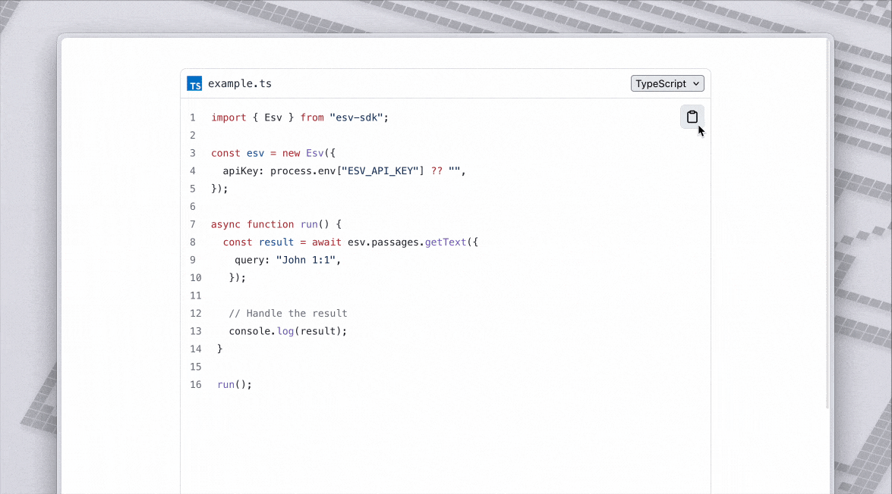

<div align="center">
 <a href="https://www.speakeasy.com/" target="_blank">
   <picture>
       <source media="(prefers-color-scheme: light)" srcset="https://github.com/user-attachments/assets/21dd5d3a-aefc-4cd3-abee-5e17ef1d4dad">
       <source media="(prefers-color-scheme: dark)" srcset="https://github.com/user-attachments/assets/0a747f98-d228-462d-9964-fd87bf93adc5">
       
   </picture>
 </a>
  <h1>Speakeasy</h1>
  <p>Build APIs your users love ❤️ with Speakeasy</p>
  <div>
   <a href="https://speakeasy.com/docs/create-client-sdks/" target="_blank"><b>Docs Quickstart</b></a>&nbsp;&nbsp;//&nbsp;&nbsp;<a href="https://join.slack.com/t/speakeasy-dev/shared_invite/zt-1cwb3flxz-lS5SyZxAsF_3NOq5xc8Cjw" target="_blank"><b>Join us on Slack</b></a>
  </div>
 <br />

</div>

<div align="center">
  <picture>
    <source media="(prefers-color-scheme: dark)" srcset="./images/codesamples-demo-dark.gif">
    
  </picture>
  <p><em>CodeSamples React Component in Action</em></p>
</div>

<!-- Start Summary [summary] -->
## Summary

Speakeasy Code Samples API: REST APIs for retrieving SDK usage snippets from the Speakeasy Code Samples API.


For more information about the API: [The Speakeasy Platform Documentation](/docs)
<!-- End Summary [summary] -->

<!-- Start Table of Contents [toc] -->
## Table of Contents
<!-- $toc-max-depth=2 -->
  * [SDK Installation](#sdk-installation)
  * [Requirements](#requirements)
  * [SDK Example Usage](#sdk-example-usage)
  * [Authentication](#authentication)
  * [Available Resources and Operations](#available-resources-and-operations)
  * [Standalone functions](#standalone-functions)
  * [React hooks with TanStack Query](#react-hooks-with-tanstack-query)
  * [Global Parameters](#global-parameters)
  * [Retries](#retries)
  * [Error Handling](#error-handling)
  * [Server Selection](#server-selection)
  * [Custom HTTP Client](#custom-http-client)
  * [Debugging](#debugging)
* [Development](#development)
  * [Maturity](#maturity)
  * [Contributions](#contributions)

<!-- End Table of Contents [toc] -->

<!-- Start SDK Installation [installation] -->
## SDK Installation

The SDK can be installed with either [npm](https://www.npmjs.com/), [pnpm](https://pnpm.io/), [bun](https://bun.sh/) or [yarn](https://classic.yarnpkg.com/en/) package managers.

### NPM

```bash
npm add @speakeasyapi/code-samples
# Install optional peer dependencies if you plan to use React hooks
npm add @tanstack/react-query react react-dom
```

### PNPM

```bash
pnpm add @speakeasyapi/code-samples
# Install optional peer dependencies if you plan to use React hooks
pnpm add @tanstack/react-query react react-dom
```

### Bun

```bash
bun add @speakeasyapi/code-samples
# Install optional peer dependencies if you plan to use React hooks
bun add @tanstack/react-query react react-dom
```

### Yarn

```bash
yarn add @speakeasyapi/code-samples
# Install optional peer dependencies if you plan to use React hooks
yarn add @tanstack/react-query react react-dom
```

> [!NOTE]
> This package is published as an ES Module (ESM) only. For applications using
> CommonJS, use `await import("@speakeasyapi/code-samples")` to import and use this package.

### Model Context Protocol (MCP) Server

This SDK is also an installable MCP server where the various SDK methods are
exposed as tools that can be invoked by AI applications.

> Node.js v20 or greater is required to run the MCP server from npm.

<details>
<summary>Claude installation steps</summary>

Add the following server definition to your `claude_desktop_config.json` file:

```json
{
  "mcpServers": {
    "SpeakeasyCodeSamples": {
      "command": "npx",
      "args": [
        "-y", "--package", "@speakeasyapi/code-samples",
        "--",
        "mcp", "start",
        "--api-key", "...",
        "--registry-url", "..."
      ]
    }
  }
}
```

</details>

<details>
<summary>Cursor installation steps</summary>

Create a `.cursor/mcp.json` file in your project root with the following content:

```json
{
  "mcpServers": {
    "SpeakeasyCodeSamples": {
      "command": "npx",
      "args": [
        "-y", "--package", "@speakeasyapi/code-samples",
        "--",
        "mcp", "start",
        "--api-key", "...",
        "--registry-url", "..."
      ]
    }
  }
}
```

</details>

You can also run MCP servers as a standalone binary with no additional dependencies. You must pull these binaries from available Github releases:

```bash
curl -L -o mcp-server \
    https://github.com/{org}/{repo}/releases/download/{tag}/mcp-server-bun-darwin-arm64 && \
chmod +x mcp-server
```

If the repo is a private repo you must add your Github PAT to download a release `-H "Authorization: Bearer {GITHUB_PAT}"`.


```json
{
  "mcpServers": {
    "Todos": {
      "command": "./DOWNLOAD/PATH/mcp-server",
      "args": [
        "start"
      ]
    }
  }
}
```

For a full list of server arguments, run:

```sh
npx -y --package @speakeasyapi/code-samples -- mcp start --help
```
<!-- End SDK Installation [installation] -->

<!-- Start Requirements [requirements] -->
## Requirements

For supported JavaScript runtimes, please consult [RUNTIMES.md](RUNTIMES.md).
<!-- End Requirements [requirements] -->

<!-- Start SDK Example Usage [usage] -->
## SDK Example Usage

### Example

```typescript
import { SpeakeasyCodeSamples } from "@speakeasyapi/code-samples";

const speakeasyCodeSamples = new SpeakeasyCodeSamples({
  registryUrl: "https://spec.speakeasy.com/my-org/my-workspace/my-source",
  apiKey: "<YOUR_API_KEY_HERE>",
});

async function run() {
  const result = await speakeasyCodeSamples.codeSamples.get({
    operationIds: [
      "g",
      "e",
      "t",
      "P",
      "e",
      "t",
      "s",
    ],
    methodPaths: [
      {
        method: "get",
        path: "/pets",
      },
    ],
    languages: [
      "python",
      "javascript",
    ],
  });

  console.log(result);
}

run();

```
<!-- End SDK Example Usage [usage] -->

### React Component

This library includes a React component that fetches and highlights code
snippets using `codehike`. Along with displaying the snippet, it shows a
loading state during fetching and provides a fallback view if an error occurs.

```tsx
import { SpeakeasyCodeSamplesCore } from "@speakeasyapi/code-samples/core";
import {
  CodeSampleFilenameTitle,
  CodeSamplesViewer,
  SpeakeasyCodeSamplesProvider,
} from "@speakeasyapi/code-samples/react";

const speakeasyCodeSamples = new SpeakeasyCodeSamplesCore({
  apiKey: "<YOUR_API_KEY_HERE>",
  registryUrl: "https://spec.speakeasy.com/org/ws/my-source",
});

function App() {
  return (
    <SpeakeasyCodeSamplesProvider client={speakeasyCodeSamples}>
      <CodeSamplesViewer
        copyable
        defaultLang={"typescript"}
        title={CodeSampleFilenameTitle}
        operation={"getPassageText"}
        // client={speakeasyCodeSamples} 
        // 👆 optional, if you want to pass the client directly 
        // instead of using the provider
      />
    </SpeakeasyCodeSamplesProvider>
  );
}
```

<!-- Start Authentication [security] -->
## Authentication

### Per-Client Security Schemes

This SDK supports the following security scheme globally:

| Name     | Type   | Scheme  |
| -------- | ------ | ------- |
| `apiKey` | apiKey | API key |

To authenticate with the API the `apiKey` parameter must be set when initializing the SDK client instance. For example:
```typescript
import { SpeakeasyCodeSamples } from "@speakeasyapi/code-samples";

const speakeasyCodeSamples = new SpeakeasyCodeSamples({
  apiKey: "<YOUR_API_KEY_HERE>",
  registryUrl: "https://spec.speakeasy.com/my-org/my-workspace/my-source",
});

async function run() {
  const result = await speakeasyCodeSamples.codeSamples.get({
    operationIds: [
      "g",
      "e",
      "t",
      "P",
      "e",
      "t",
      "s",
    ],
    methodPaths: [
      {
        method: "get",
        path: "/pets",
      },
    ],
    languages: [
      "python",
      "javascript",
    ],
  });

  console.log(result);
}

run();

```
<!-- End Authentication [security] -->

<!-- Start Available Resources and Operations [operations] -->
## Available Resources and Operations

<details open>
<summary>Available methods</summary>

### [CodeSamples](docs/sdks/codesamples/README.md)

* [get](docs/sdks/codesamples/README.md#get) - Retrieve usage snippets

</details>
<!-- End Available Resources and Operations [operations] -->

<!-- Start Standalone functions [standalone-funcs] -->
## Standalone functions

All the methods listed above are available as standalone functions. These
functions are ideal for use in applications running in the browser, serverless
runtimes or other environments where application bundle size is a primary
concern. When using a bundler to build your application, all unused
functionality will be either excluded from the final bundle or tree-shaken away.

To read more about standalone functions, check [FUNCTIONS.md](./FUNCTIONS.md).

<details>

<summary>Available standalone functions</summary>

- [`codeSamplesGet`](docs/sdks/codesamples/README.md#get) - Retrieve usage snippets

</details>
<!-- End Standalone functions [standalone-funcs] -->

<!-- Start React hooks with TanStack Query [react-query] -->
## React hooks with TanStack Query

React hooks built on [TanStack Query][tanstack-query] are included in this SDK.
These hooks and the utility functions provided alongside them can be used to
build rich applications that pull data from the API using one of the most
popular asynchronous state management library.

[tanstack-query]: https://tanstack.com/query/v5/docs/framework/react/overview

To learn about this feature and how to get started, check
[REACT_QUERY.md](./REACT_QUERY.md).

> [!WARNING]
>
> This feature is currently in **preview** and is subject to breaking changes
> within the current major version of the SDK as we gather user feedback on it.

<details>

<summary>Available React hooks</summary>

- [`useCodeSamples`](docs/sdks/codesamples/README.md#get) - Retrieve usage snippets

</details>
<!-- End React hooks with TanStack Query [react-query] -->

<!-- Start Global Parameters [global-parameters] -->
## Global Parameters

A parameter is configured globally. This parameter may be set on the SDK client instance itself during initialization. When configured as an option during SDK initialization, This global value will be used as the default on the operations that use it. When such operations are called, there is a place in each to override the global value, if needed.

For example, you can set `registry_url` to `"https://spec.speakeasy.com/org/ws/my-source"` at SDK initialization and then you do not have to pass the same value on calls to operations like `get`. But if you want to do so you may, which will locally override the global setting. See the example code below for a demonstration.


### Available Globals

The following global parameter is available.

| Name        | Type   | Description                                           |
| ----------- | ------ | ----------------------------------------------------- |
| registryUrl | string | The registry URL from which to retrieve the snippets. |

### Example

```typescript
import { SpeakeasyCodeSamples } from "@speakeasyapi/code-samples";

const speakeasyCodeSamples = new SpeakeasyCodeSamples({
  registryUrl: "https://spec.speakeasy.com/my-org/my-workspace/my-source",
  apiKey: "<YOUR_API_KEY_HERE>",
});

async function run() {
  const result = await speakeasyCodeSamples.codeSamples.get({
    operationIds: [
      "g",
      "e",
      "t",
      "P",
      "e",
      "t",
      "s",
    ],
    methodPaths: [
      {
        method: "get",
        path: "/pets",
      },
    ],
    languages: [
      "python",
      "javascript",
    ],
  });

  console.log(result);
}

run();

```
<!-- End Global Parameters [global-parameters] -->

<!-- Start Retries [retries] -->
## Retries

Some of the endpoints in this SDK support retries.  If you use the SDK without any configuration, it will fall back to the default retry strategy provided by the API.  However, the default retry strategy can be overridden on a per-operation basis, or across the entire SDK.

To change the default retry strategy for a single API call, simply provide a retryConfig object to the call:
```typescript
import { SpeakeasyCodeSamples } from "@speakeasyapi/code-samples";

const speakeasyCodeSamples = new SpeakeasyCodeSamples({
  registryUrl: "https://spec.speakeasy.com/my-org/my-workspace/my-source",
  apiKey: "<YOUR_API_KEY_HERE>",
});

async function run() {
  const result = await speakeasyCodeSamples.codeSamples.get({
    operationIds: [
      "g",
      "e",
      "t",
      "P",
      "e",
      "t",
      "s",
    ],
    methodPaths: [
      {
        method: "get",
        path: "/pets",
      },
    ],
    languages: [
      "python",
      "javascript",
    ],
  }, {
    retries: {
      strategy: "backoff",
      backoff: {
        initialInterval: 1,
        maxInterval: 50,
        exponent: 1.1,
        maxElapsedTime: 100,
      },
      retryConnectionErrors: false,
    },
  });

  console.log(result);
}

run();

```

If you'd like to override the default retry strategy for all operations that support retries, you can provide a retryConfig at SDK initialization:
```typescript
import { SpeakeasyCodeSamples } from "@speakeasyapi/code-samples";

const speakeasyCodeSamples = new SpeakeasyCodeSamples({
  retryConfig: {
    strategy: "backoff",
    backoff: {
      initialInterval: 1,
      maxInterval: 50,
      exponent: 1.1,
      maxElapsedTime: 100,
    },
    retryConnectionErrors: false,
  },
  registryUrl: "https://spec.speakeasy.com/my-org/my-workspace/my-source",
  apiKey: "<YOUR_API_KEY_HERE>",
});

async function run() {
  const result = await speakeasyCodeSamples.codeSamples.get({
    operationIds: [
      "g",
      "e",
      "t",
      "P",
      "e",
      "t",
      "s",
    ],
    methodPaths: [
      {
        method: "get",
        path: "/pets",
      },
    ],
    languages: [
      "python",
      "javascript",
    ],
  });

  console.log(result);
}

run();

```
<!-- End Retries [retries] -->

<!-- Start Error Handling [errors] -->
## Error Handling

[`SpeakeasyCodeSamplesError`](./src/models/errors/speakeasycodesampleserror.ts) is the base class for all HTTP error responses. It has the following properties:

| Property            | Type       | Description                                                                             |
| ------------------- | ---------- | --------------------------------------------------------------------------------------- |
| `error.message`     | `string`   | Error message                                                                           |
| `error.statusCode`  | `number`   | HTTP response status code eg `404`                                                      |
| `error.headers`     | `Headers`  | HTTP response headers                                                                   |
| `error.body`        | `string`   | HTTP body. Can be empty string if no body is returned.                                  |
| `error.rawResponse` | `Response` | Raw HTTP response                                                                       |
| `error.data$`       |            | Optional. Some errors may contain structured data. [See Error Classes](#error-classes). |

### Example
```typescript
import { SpeakeasyCodeSamples } from "@speakeasyapi/code-samples";
import * as errors from "@speakeasyapi/code-samples/models/errors";

const speakeasyCodeSamples = new SpeakeasyCodeSamples({
  registryUrl: "https://spec.speakeasy.com/my-org/my-workspace/my-source",
  apiKey: "<YOUR_API_KEY_HERE>",
});

async function run() {
  try {
    const result = await speakeasyCodeSamples.codeSamples.get({
      operationIds: [
        "g",
        "e",
        "t",
        "P",
        "e",
        "t",
        "s",
      ],
      methodPaths: [
        {
          method: "get",
          path: "/pets",
        },
      ],
      languages: [
        "python",
        "javascript",
      ],
    });

    console.log(result);
  } catch (error) {
    // The base class for HTTP error responses
    if (error instanceof errors.SpeakeasyCodeSamplesError) {
      console.log(error.message);
      console.log(error.statusCode);
      console.log(error.body);
      console.log(error.headers);

      // Depending on the method different errors may be thrown
      if (error instanceof errors.ErrorT) {
        console.log(error.data$.message); // string
        console.log(error.data$.statusCode); // number
      }
    }
  }
}

run();

```

### Error Classes
**Primary errors:**
* [`SpeakeasyCodeSamplesError`](./src/models/errors/speakeasycodesampleserror.ts): The base class for HTTP error responses.
  * [`ErrorT`](./src/models/errors/errort.ts): The `Status` type defines a logical error model. Status code `4XX`.

<details><summary>Less common errors (6)</summary>

<br />

**Network errors:**
* [`ConnectionError`](./src/models/errors/httpclienterrors.ts): HTTP client was unable to make a request to a server.
* [`RequestTimeoutError`](./src/models/errors/httpclienterrors.ts): HTTP request timed out due to an AbortSignal signal.
* [`RequestAbortedError`](./src/models/errors/httpclienterrors.ts): HTTP request was aborted by the client.
* [`InvalidRequestError`](./src/models/errors/httpclienterrors.ts): Any input used to create a request is invalid.
* [`UnexpectedClientError`](./src/models/errors/httpclienterrors.ts): Unrecognised or unexpected error.


**Inherit from [`SpeakeasyCodeSamplesError`](./src/models/errors/speakeasycodesampleserror.ts)**:
* [`ResponseValidationError`](./src/models/errors/responsevalidationerror.ts): Type mismatch between the data returned from the server and the structure expected by the SDK. See `error.rawValue` for the raw value and `error.pretty()` for a nicely formatted multi-line string.

</details>
<!-- End Error Handling [errors] -->

<!-- Start Server Selection [server] -->
## Server Selection

### Select Server by Name

You can override the default server globally by passing a server name to the `server: keyof typeof ServerList` optional parameter when initializing the SDK client instance. The selected server will then be used as the default on the operations that use it. This table lists the names associated with the available servers:

| Name   | Server                           | Description |
| ------ | -------------------------------- | ----------- |
| `prod` | `https://api.prod.speakeasy.com` |             |

#### Example

```typescript
import { SpeakeasyCodeSamples } from "@speakeasyapi/code-samples";

const speakeasyCodeSamples = new SpeakeasyCodeSamples({
  server: "prod",
  registryUrl: "https://spec.speakeasy.com/my-org/my-workspace/my-source",
  apiKey: "<YOUR_API_KEY_HERE>",
});

async function run() {
  const result = await speakeasyCodeSamples.codeSamples.get({
    operationIds: [
      "g",
      "e",
      "t",
      "P",
      "e",
      "t",
      "s",
    ],
    methodPaths: [
      {
        method: "get",
        path: "/pets",
      },
    ],
    languages: [
      "python",
      "javascript",
    ],
  });

  console.log(result);
}

run();

```

### Override Server URL Per-Client

The default server can also be overridden globally by passing a URL to the `serverURL: string` optional parameter when initializing the SDK client instance. For example:
```typescript
import { SpeakeasyCodeSamples } from "@speakeasyapi/code-samples";

const speakeasyCodeSamples = new SpeakeasyCodeSamples({
  serverURL: "https://api.prod.speakeasy.com",
  registryUrl: "https://spec.speakeasy.com/my-org/my-workspace/my-source",
  apiKey: "<YOUR_API_KEY_HERE>",
});

async function run() {
  const result = await speakeasyCodeSamples.codeSamples.get({
    operationIds: [
      "g",
      "e",
      "t",
      "P",
      "e",
      "t",
      "s",
    ],
    methodPaths: [
      {
        method: "get",
        path: "/pets",
      },
    ],
    languages: [
      "python",
      "javascript",
    ],
  });

  console.log(result);
}

run();

```
<!-- End Server Selection [server] -->

<!-- Start Custom HTTP Client [http-client] -->
## Custom HTTP Client

The TypeScript SDK makes API calls using an `HTTPClient` that wraps the native
[Fetch API](https://developer.mozilla.org/en-US/docs/Web/API/Fetch_API). This
client is a thin wrapper around `fetch` and provides the ability to attach hooks
around the request lifecycle that can be used to modify the request or handle
errors and response.

The `HTTPClient` constructor takes an optional `fetcher` argument that can be
used to integrate a third-party HTTP client or when writing tests to mock out
the HTTP client and feed in fixtures.

The following example shows how to:
- route requests through a proxy server using [undici](https://www.npmjs.com/package/undici)'s ProxyAgent
- use the `"beforeRequest"` hook to add a custom header and a timeout to requests
- use the `"requestError"` hook to log errors

```typescript
import { SpeakeasyCodeSamples } from "@speakeasyapi/code-samples";
import { ProxyAgent } from "undici";
import { HTTPClient } from "@speakeasyapi/code-samples/lib/http";

const dispatcher = new ProxyAgent("http://proxy.example.com:8080");

const httpClient = new HTTPClient({
  // 'fetcher' takes a function that has the same signature as native 'fetch'.
  fetcher: (input, init) =>
    // 'dispatcher' is specific to undici and not part of the standard Fetch API.
    fetch(input, { ...init, dispatcher } as RequestInit),
});

httpClient.addHook("beforeRequest", (request) => {
  const nextRequest = new Request(request, {
    signal: request.signal || AbortSignal.timeout(5000)
  });

  nextRequest.headers.set("x-custom-header", "custom value");

  return nextRequest;
});

httpClient.addHook("requestError", (error, request) => {
  console.group("Request Error");
  console.log("Reason:", `${error}`);
  console.log("Endpoint:", `${request.method} ${request.url}`);
  console.groupEnd();
});

const sdk = new SpeakeasyCodeSamples({ httpClient: httpClient });
```
<!-- End Custom HTTP Client [http-client] -->

<!-- Start Debugging [debug] -->
## Debugging

You can setup your SDK to emit debug logs for SDK requests and responses.

You can pass a logger that matches `console`'s interface as an SDK option.

> [!WARNING]
> Beware that debug logging will reveal secrets, like API tokens in headers, in log messages printed to a console or files. It's recommended to use this feature only during local development and not in production.

```typescript
import { SpeakeasyCodeSamples } from "@speakeasyapi/code-samples";

const sdk = new SpeakeasyCodeSamples({ debugLogger: console });
```
<!-- End Debugging [debug] -->

<!-- Placeholder for Future Speakeasy SDK Sections -->

# Development

## Maturity

This SDK is in beta, and there may be breaking changes between versions without a major version update. Therefore, we recommend pinning usage
to a specific package version. This way, you can install the same version each time without breaking changes unless you are intentionally
looking for the latest version.

## Contributions

While we value open-source contributions to this SDK, this library is generated programmatically. Any manual changes added to internal files will be overwritten on the next generation.
We look forward to hearing your feedback. Feel free to open a PR or an issue with a proof of concept and we'll do our best to include it in a future release.

### SDK Created by [Speakeasy](https://www.speakeasy.com/?utm_source=@speakeasyapi/code-samples&utm_campaign=typescript)
